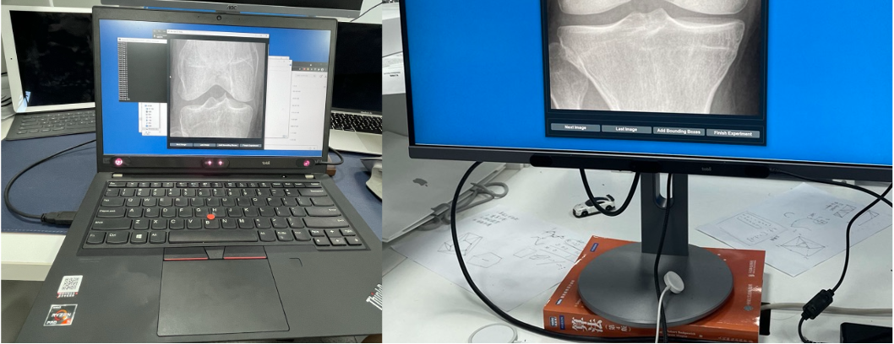

# MicEye-v2.0

<p align="center">
  
</p>
Our software is updated with [MicEye](https://github.com/JamesQFreeman/MicEye).
We add the function of zooming and dragging image. We also support more free and flexible image post-processing and saving.

## Why use MicEye

### Versatile
As a label tool, we support 

1. class label (keyboard typing)
2. bounding boxes (mouse draw)
3. keypoint label (use eye gaze)
4. zoom and drag image (mouse rool and drag)
   
During aforemention annotation process, all eye movement will be recorded.

### Cheaper
Start your research using less than 200 bucks! Comparing to other existing software, we use cheaper and more easily obtainable hardware, i.e., Tobii Eye Tracker 4C and Tobii Eye Tracker 5.

### Easier
Here we domonstrate some use cases, you can use it on the go with a laptop or use it on your desk monitor. It should be handful if you want to take it with you to collect data. Credit to Tobii's consumer product lineup, they did pack some really sick hardware in a small form factor.



And the code is easy to modify since it is PyQt.


Linus Torvalds said he built Linux "just for fun". Hopefully, if you find this eye tracking things fun, MicEye could help you start something big.

## A demo
We domonstrate an example of radiologist reading knee X-Ray images. Of cause, you could use it in natural image. 


This red bubble is for demonstration, do not exist in real software. 

## Citation

```
@article{wang2022follow,
  title={Follow My Eye: Using Gaze to Supervise Computer-Aided Diagnosis},
  author={Wang, Sheng and Ouyang, Xi and Liu, Tianming and Wang, Qian and Shen, Dinggang},
  journal={IEEE Transactions on Medical Imaging},
  year={2022},
  publisher={IEEE}
}
```

## Contact me

Github issue or wsheng@sjtu.edu.cn
